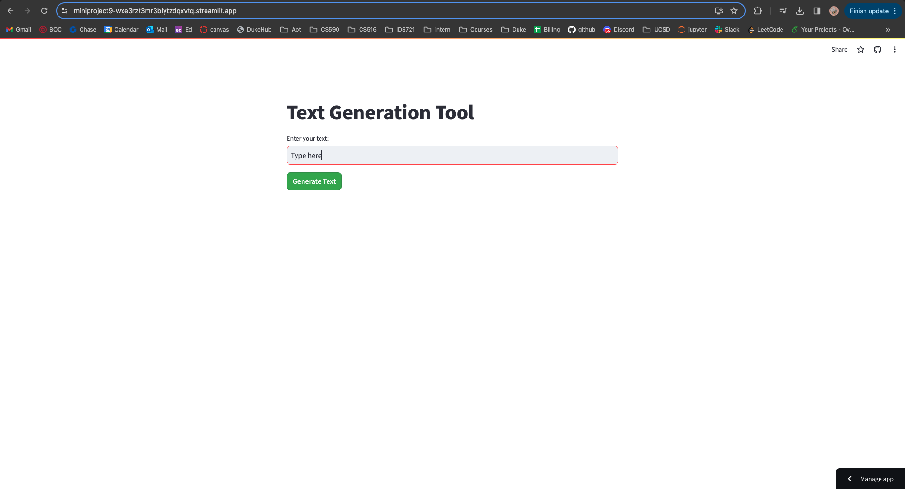
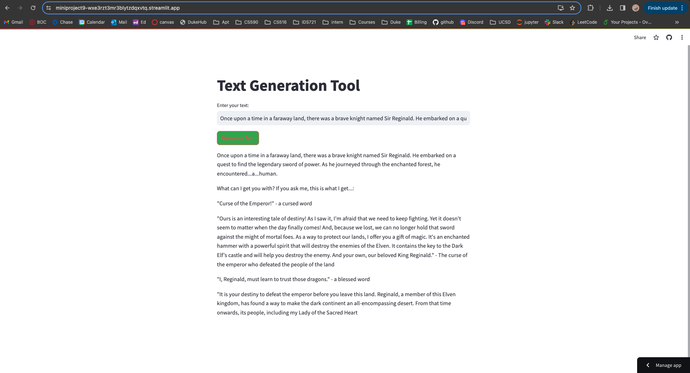

# Streamlit App with a Hugging Face Model

In this project, I created a website using Streamlit, connected to an open-source LLM (Hugging Face), and deployed the model via Streamlight

## Connection to an open source LLM (Hugging Face):

1. Install streamlit transformers tensorflow tf-keras

```bash
pip3 install streamlit transformers tensorflow tf-keras
```

2. Test that the installation worked for streamlit by launching the Streamlit Hello example app:

```bash
streamlit hello
```

this will auto-direct you to a page in your default web browser.

3. Create an App and Run Streamlit app on local laptop:

- 3.1. Create a file named `app.py` in the project folder, connect to LLM, and write code to customize the visual appearance of the app.
- 3.2. Run Streamlit app:

```bash
streamlit run app.py
```
similar to the hello example, this will auto-direct you to a page in your default web browser, or you can copy and paste the URL.

## Deployment on Streamlit Cloud

1. create a requirements.txt file in the current project folder and put the dependencies into it. In our case, they are streamlit transformers tensorflow tf-keras

2. Push the work to GitHub, sign up on Streamlit Cloud, and at the top right corner, select New App. Follow the instructions to select the GitHub path for this project select Deploy.


## Output

I customized the button color and also changed the Button color on hover.




